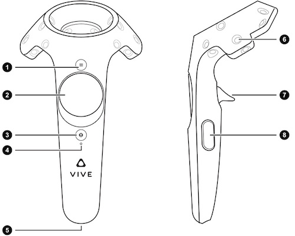
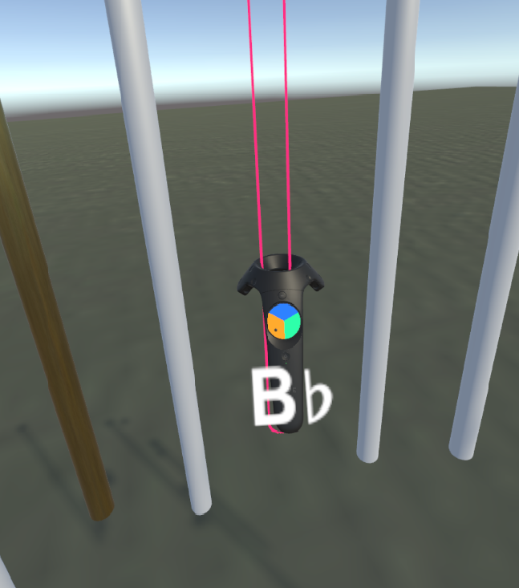

# 3D Virtual Chimes
### by Kayla Beckham & Brighten Jelke
Inspired by the IEEE 3DUI contest from 2015, this project recreates orchestral chimes, also known as tubular bells, 
in virtual reality using Unity, SteamVR, and the HTC Vive (headset and two standard controllers).

## How to Build and Run
This project should be run straight from the Unity Editor. The name of the scene is "TubularBells" and it is stored in D:/student work/tubular bells/Assets/Scenes. SteamVR should start up automatically when you click "play".

## How to Play

This is a diagram of all the buttons on a Vive controller, as seen in the [Unity Manual](https://docs.unity3d.com/Manual/OpenVRControllers.html). Numbers below will correspond to buttons on this diagram to indicate the location of buttons on the controller.

When the program begins, one of the controllers looks like a hammer, and the other looks like a Vive controller. The trigger button on the back of the controller (7) can toggle that hand to be a hammer or back to a controller.

When the hand is a controller, you can use it to group chimes together to play chords. Touch a chime with the controller and use the trackpad on the front of the controller (2) to assign a group to the chime. You know you are touching the chime because it appears transparent with a pink outline. You will also see the name of the musical note that chime produces. If you click a section of the trackpad that is orange, green, or blue, the chime will be added to the group of that color and a marker will appear on the chime. Click again on the same color to turn it off. Each active colored marker appears at the same height across all the chimes, so that it is easier to tell at a glance which ones are in each group.

Hit the chimes with the head of your hammer(s) to play a note. You will feel the corresponding hammer vibrate. Each chime plays a different note, but the sound is not affected by where on the chime you hit, unless you hit the chime on an activated group marker. This will play all the chimes that have the same group marker at once. 

You will also see particle effects for each chime that sounded. The color (blue, green, or orange) corresponds to the chord group you just played, with white for a single note. Use the small round menu button at the top of the controller (1) to toggle the visual particle response on or off.

Use the side grip buttons (8) to dampen sound. In the current implementation, this just turns the volume down by a preset amount, and it will return to the original volume when the grip is released. You can toggle the particle effects and dampen the sound with either controller, whether it appears as a controller or a hammer.

## Demo

## Overall Architecture
This project was developed in Unity, so a lot of the structure was determined by the editor. The TubularBells scene has our  game objects and scripts acting together to run during play. Materials and models used came from the Unity Asset Store. The color selection image and sound files were created by us for this project.

The GenerateChimes script is attached to the "CylinderHolder" parent object. It creates chime game objects during runtime from cylinders (using measurements we took from real chimes) and attaches all the necessary assets to each chime. This includes SoundClip objects for each note, different materials, colliders, instances of our BellCollider script, and particle generators.

Each chime has its own instance of BellCollider, which handles intersections between hammers and controllers with the chimes. It also keeps track of chime groupings and the group markers for each chime. The BellCollider script has three static ArrayLists to keep track of the chimes in each group, and when a group marker is hit it plays the SoundClip of every chime in the list and triggers the visual particle effect in the group's color, if the effect is enabled.

The SelectionState script manages the rendering models and button input for the controller that can be changed into a hammer. It is referenced in BellCollider to know what effects certain collisions should have.

## Important Performance Issues
Poor tracking the headset and controllers in the corners of the cave / Vive camera range can cause disorientation and dizziness in some users.

Dampening the sound of the chimes is currently not implemented to our satisfaction. When you press the dampening button, volume is turned down for the duration that you hold the button. It would be more realistic to make the sounds playing at the time of dampening quieter for the rest of the time that they are playing, or to stop them playing altogether by dampening them for long enough. It would be better if dampening was be mapped to a gesture instead of a button press, or if there was a way to dampen one chime at a time.

## Known Bugs
The capacity of particle effects is currently set to 500. It is difficult, but possible, to hit the capacity. No new particle 
effects will be rendered for a few seconds until some of them go out of range.

There is a disconnect between the SteamVR input handler getting data from the menu button press and actually seeing the visual particle effects being turned on and off. We can get the effects to toggle on/off with both controllers, but you have to press the button fairly hard and sometimes it doesn't turn things off even though the input handler registers a change from true to false. Our best guess is that we made a mistake with that particular button mapping or the way it interacts with the OnButtonDown callbacks in the code. All other button presses work perfectly well.

## Results
Our goals for this project were to make a musical instrument in virtual reality that could play notes and chords, and that would be easy to learn and fun to play. We also wanted our intstrument to reference a real world instrument, to give the user a sense of familliarity and bodily presence, but we wanted to make sure to fully utilize the "virtual" aspect of virtual reality and create an instrument that could never exist in real life. We achieved our goals.
